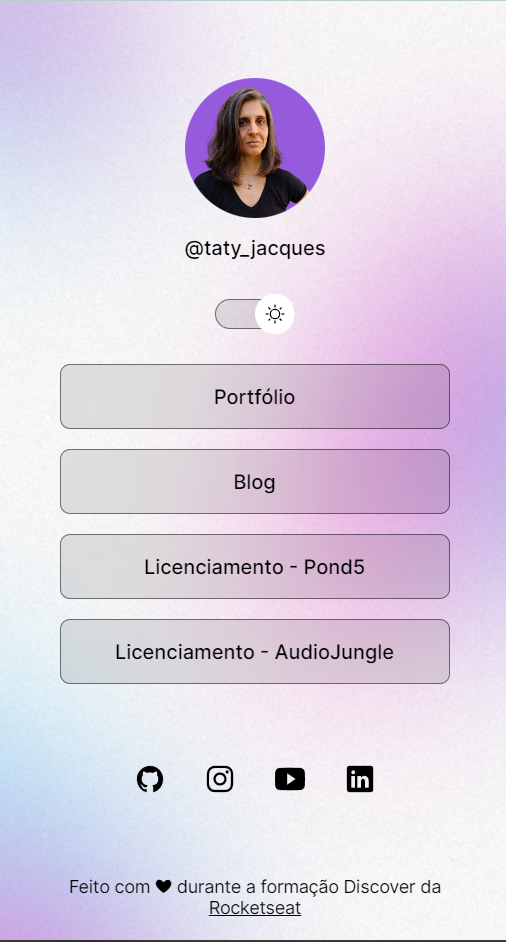

<h1 align="center"> DevLinks-Rocketseat </h1>

Programa desenvolvido durante a trilha Discover da Rocketseat.

  <a href="#-tecnologias">Tecnologias</a>&nbsp;&nbsp;&nbsp;|&nbsp;&nbsp;&nbsp;
  <a href="#-projeto">Projeto</a>&nbsp;&nbsp;&nbsp;|&nbsp;&nbsp;&nbsp;
  <a href="#-layout">Layout</a>&nbsp;&nbsp;&nbsp;|&nbsp;&nbsp;&nbsp;
  <a href="#memo-licença">Licença</a>

  

## 🚀 Tecnologias

Esse projeto foi desenvolvido com as seguintes tecnologias:

- HTML e CSS
- JavaScript
- Git e Github
- Figma

## 💻 Projeto

O Devlinks é um agregador de links que pode ser utilizado como cartão de visitas on-line.

## 🔖 Layout

Você pode visualizar o layout do projeto através [DESSE LINK](<https://www.figma.com/design/SF6HLmgicQX0x5ATLdMwuC/DevLinks-%E2%80%A2-Projeto-Discover-(Community)?node-id=10-620&t=rbyHCdvKJqTcSz25-0>). É necessário ter conta no [Figma](https://figma.com) para acessá-lo.
